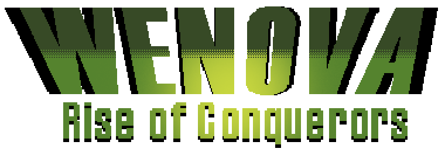

# Wenova - Rise of Conquerors

## Sumário
* [1. Descrição do Jogo](#1-descrição-do-jogo)  
* [2. Informações Gerais](#2-informações-gerais)
* [2.1. História](#21-história)
* [2.2. Screenshots](#22-screenshots)
* [2.3. Gameplay](#23-gameplay)   
* [3. Jogabilidade](#3-jogabilidade)
* [3.1. Objetivos](#31-objetivos)
* [3.2. Controles](#32-controles)     
* [4. Outras Informações](#4-outras-informações)
* [4.1. Dependências](#41-dependências)   
* [4.2. Instalação e Compilação](#42-instalação-e-compilação)
* [4.3. Licença](#43-licença)
* [5. Time](#5-time)   

------------------------------------------------------------

## 1. Descrição do Jogo
***Wenova - Rise of Conquerors*** é um jogo de luta 2D. O jogo poderá ser jogado por 4 pessoas, sendo batalhas 2x2 (similar a jogos como *Super Smash Bros* e *Towerfall Ascension*). Os personagens também possuirão habilidades especiais (similar ao jogo *Overwatch*).

## 2. Informações Gerais
### 2.1. História
Em Aetheron existe uma balança muito instável, onde já acontece uma instabilidade com relação ao uso de seu planeta, mas o problema de superpopulação ainda acontece e por isso realizam expedições para achar mundos habitáveis.

Já o povo de Akhoria é muito ligado ao seus deuses, estes que explicaram a existência de outros mundos e capacitaram seu povo a explorâ-los. Dessa forma, os deuses também falaram sobre a existência de outros deles e de seus símbolos, criando um espírito pioneiro e explorador em seu povo e fazendo com que eles fossem procurar por novos mundos para entrar em comunhão com novos deuses.

Nessa grande exploração espacial e procura de novos mundos, esses dois encontram Wenova, um mundo "virgem" apenas habitado por uma fauna não muito evoluída e por uma vasta flora e, por causa de suas necessidades, eles acabam por querer habitar este mundo entrando assim em conflito.

### 2.2. Screenshots

[TL;DR Vá para Gameplay](#23-gameplay)

Menu do Inicial Jogo

Menu do Jogo

Tela de Opções do Jogo

Tela de Controle do Joystick

Tela de Controle do Teclado

Tela de Teste do Joystick

Tela de Seleção de Estágio

Tela de Seleção de Personagem

Tela para Inicialização do Jogo

Tela para Inicialização do Jogo (Outros personagens)

Fase Waterfall 1

Fase Waterfall 2

Fase Waterfall 3

Fase Mangrove 1

Fase Mangrove 2

Fase Mangrove 3

Fase Mangrove 4

Tela de Vitória do Time 1

Tela de Vitória do Time 2

Tela de Empate

### 2.3. Gameplay

O gameplay deste jogo pode ser acessado por este [link](https://youtu.be/oDbqc0H2Fv4).

## 3. Jogabilidade

### 3.1. Objetivos
O objetivo do jogo é vencer a dupla inimiga, utilizando-se das habilidades dos personagens e também da sinergia que eles possuem. O jogo será finalizado após duas condições: uma dupla ser totalmente eliminada ou o tempo limite acabar. Se a condição de tempo for acionada, o jogo determinará o vencedor a partir dos seguintes critérios:

* Quantidade de jogadores vivos no time;
* Soma dos *lifes* da dupla, caso todos estejam vivos;
* Maior *life*, caso apenas 1 de cada time esteja vivo.

Caso nenhum critério seja atentido, será declarado empate.

### 3.2. Controles

As ações dos 4 jogadores durante o jogo serão controladas por joysticks. Como alternativa, é possível substituir qualquer um dos joysticks pelo teclado.

As ações principais do jogador estão listadas abaixo:

| Contexto | Ações |
| :------: | --- |
| Menus | 

<li>Direcionais</li><li>Selecionar</li><li>Cancelar</li><li>Bloquear</li>

 |
| Batalha | 

<li>Movimentação</li><li>Pular</li><li>Agachar</li><li>Ataque base</li><li>Ataques direcionais</li><li>Ataques direcionais no pulo</li><li>Ataques direcionais ao agachar</li><li>Habilidade 1</li><li>Habilidade 2</li><li>Ataque Especial</li>

 |

Abaixo se encontram os mapeamentos das teclas dos joysticks e do teclado, respectivamente (em inglês):

## 4. Outras Informações
### 4.1. Dependências

* **C++**

`c++`

* **SDL 2.0**

`libsdl2-2.0-0 libsdl2-dev`

* **SDL Image 2.0**

`libsdl2-image-2.0-0 libsdl2-image-dev`

* **SDL Mixer 2.0**

`libsdl2-mixer-2.0-0 libsdl2-mixer-dev`

* **SDL TTF 2.0**

`libsdl2-ttf-2.0-0 libsdl2-ttf-dev`

### 4.2. Instalação e Compilação

* **Instalar**

__Passo 1:__ Clone o repositório

`$ git clone https://github.com/LManaslu/Wenova.git`

__Passo 2:__ Instale o compilador de C++

`$ sudo apt-get install g++`

__Passo 3:__ Instale as bibliotecas SDL

`$ sudo apt-get install libsdl2-2.0-0 libsdl2-dev libsdl2-image-2.0-0 libsdl2-image-dev libsdl2-ttf-2.0-0 libsdl2-ttf-dev libsdl2-mixer-2.0-0 libsdl2-mixer-dev -y`

* **Compilar**

Para compilar todos os arquivos .cpp da pasta src/ e todos os cabeçalhos .h da pasta include/, use o comando `make`:

`$ make`

Opcionalmente, para uma compilação mais rápida, você pode usar a flag -j:

`$ make -j`

* **Limpar pasta obj/**

Para remover todos os arquivos .d e .o da pasta obj/ , utilize o comando clean:

`$ make clean`

* **Limpar pasta obj/ e deletar executável do jogo**

Para remover todos os arquivos .d e .o da pasta obj/ e excluir o binário executável da pasta bin/, utilize o comando **dist-clean**:

`$ make dist-clean`

* **Execução do Jogo**

Para rodar o jogo compilado, utilize o comando `run`:

`$ make run`

### 4.3. Licença

A licença deste jogo pode ser visualizada [aqui](LICENSE).

## 5. Time

A equipe responsável pelo desenvolvimento do jogo ***Wenova - Rise of Conquerors*** é formada por:

### Desenvolvimento
* Igor Ribeiro Barbosa Duarte
* João Paulo Busche da Cruz
* João Vitor Araujo Moura
* Vítor Barbosa de Araujo

### Arte
* Francisco Sales de Melo Matias
* Rodrigo Maia Dal Moro

### Música
* Enzo Aprile Lopes Velloso
